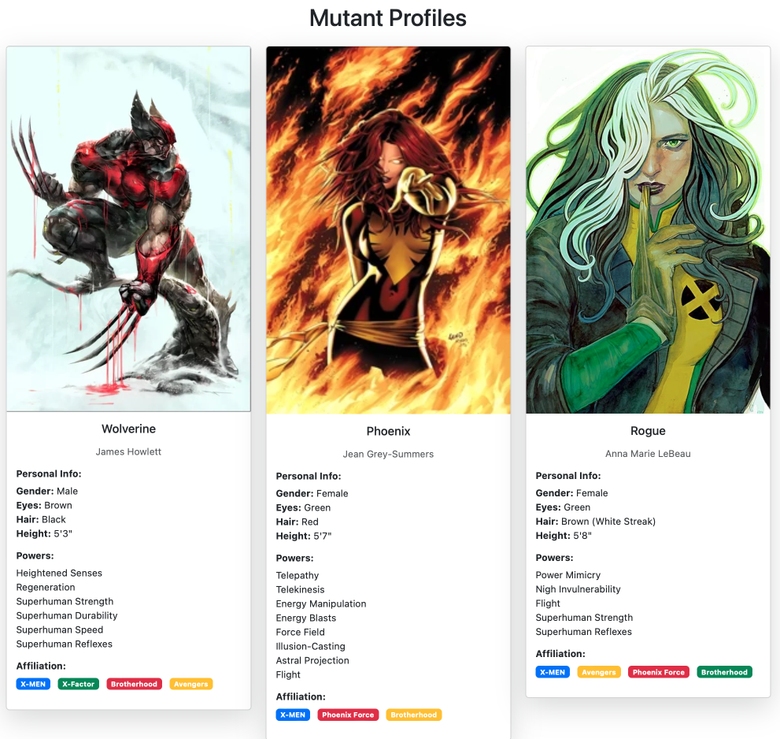
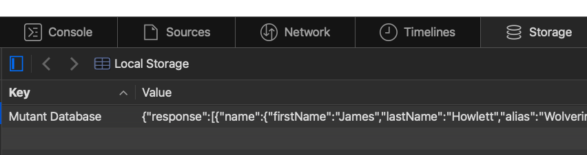

# MUTANT DATABASE

Multi-Step Project using localStorage to manipulate Data.

Check the browsers Web Inspector (Chrome) or Inspect Element (Safari) > Storage > Local Storage is prefilled with the test data. 

	
# DESCRIPTION

Data has already been provided and stored in the localStorage. Load the data, parse and display the data in the HTML.

- LocalStorage 
	- key name has already been provided within the Object
	- data will store the Object data from the localStorage

- function: loadDataSource()
	- will load the data using the localStorage keyName
  - parse the loaded data from String to Object
  - save to the data property of the Database object
  - pass the data property of Database to displayData as a parameter.

- function: displayData( )
	- using the parameter provided
  - display the data in the HTML

	
# REQUIREMENTS

## JavaScript

- document
	- querySelector( value )
  - insertAdjacentHTML( position, value)
  - innerText or innerHTML
- JSON.
	- parse( value )
- localStorage.
	- getItem( key, value )
- Object.
	- key
- Iterator
	- for() or .forEach() or for( in )

## HTML

- Use the provided template or create your own layout displaying all fields

## CSS

- width and height
- margin
- padding
- font

*Be creative when designing the page*
*Test code constantly*

# ADVANCED *Extended Time 01/12/25*

- Create a method to
	- process arrays within the object
  - wrap it in HTML
  - return the HTML
  - call the method within displayData()
- Upgrade the database from localStorage to IndexedDB
	- transfer the data from localStorage to IndexedDB
  - Create a single Object interface that manages the connection and querying of data from the IndexDb API
- Display all data using the IndexedDB API